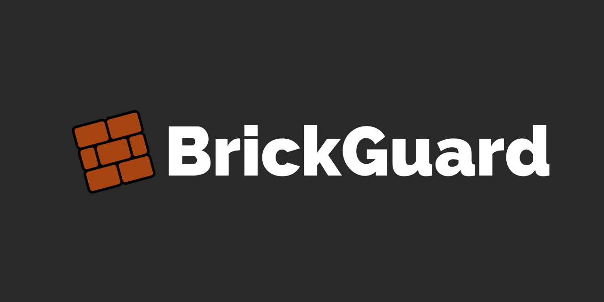

# BrickGuard

## Installation

## Demo

## Description

An accountability based ads + adult filter to help meet your productivity goals 💪

😩 Tired of ads and adult content? Want a no-fuss way to get rid of them completely?

🏃 Want to hold yourself accountable to your internet history?

BrickGuard sets up a VPN tunnel with an internal dnsmasq resolver targetted at blocking adult and ad domains.

**Toggle filter level** - toggle your desired internet filter level. Behind the scenes, BrickGuard automatically routes your internet traffic to cleanbrowsing.org or OpenDNS servers that do a pre-filtering on malicious websites ⚡

**Block and track your internet traffic** - BrickGuard uses an internal dnsmasq resolver that captures and tracks the malicious sites you attempt to visit 👀

**Blacklist custom domains** - You get to choose which domains you don't want to see 🙈

**Accountability partner emails** - 🌟🌟🌟 Here's where it gets cool! If you specify an accountability partner email, BrickGuard sends weekly reports about the malicious sites you've tried to visit, as well as any attempts to change the service configuration 💂

## Behind the scenes

This application creates a VPN tunnel to handle all DNS requests. An internal dnsmasq resolver parses dnsmasq configuration files to block attempts to malicious domains, and selects upstream DNS servers from cleanbrowsing.org and OpenDNS Family Shield to safely protect the user from accessing blocked domains. A worker thread sends a usage report every week to a specified accountability partner email address.

## Requirements

* Minimum Android version: >= 5.0 (API 21)
* Recommended Android version: >= 7.1 (API 25)

## Donate ❤️

This project needs you! If you would like to support this project's further development, the creator of this project or the continuous maintenance of this project, feel free to donate. Your donation is highly appreciated (and I love food, coffee and beer). Thank you!

**PayPal**

[Choose how much you want to donate](https://www.paypal.com/donate/?business=FRC6AV3WFYN34&item_name=Support+for+BrickGuard+project&currency_code=GBP), all donations are welcome!

**My Bitcoin Wallet (Bitcoin only)**

	1392FJmmy3ZyB5TrJLCwjduTBxh11vnFj5

**My Ethereum Wallet (Ethereum only)**

	0x35bd1553bb3d137c96f969bb414f2fde9bc5c83e

## Open Source Licenses

* __[Daedalus](https://github.com/iTXTech/Daedalus)__ by *[iTX Technologies](https://github.com/iTXTech)* - [GPLv3](https://github.com/iTXTech/Daedalus#license)
* __[MPAndroidChart](https://github.com/PhilJay/MPAndroidChart)__ by *[Philipp Jahoda](https://github.com/PhilJay)* - [APL 2.0](https://github.com/PhilJay/MPAndroidChart#license-page_facing_up)
* __[ClearEditText](https://github.com/MrFuFuFu/ClearEditText)__ by *[Yuan Fu](https://github.com/MrFuFuFu)* - [APL 2.0](https://github.com/MrFuFuFu/ClearEditText)
* __[DNS66](https://github.com/julian-klode/dns66)__ by *[Julian Andres Klode](https://github.com/julian-klode)* - [GPLv3](https://github.com/julian-klode/dns66/blob/master/COPYING)
* __[Pcap4J](https://github.com/kaitoy/pcap4j)__ by *[Kaito Yamada](https://github.com/kaitoy)* - [MIT](https://github.com/kaitoy/pcap4j)
* __[MiniDNS](https://github.com/MiniDNS/minidns)__ by *[MiniDNS](https://github.com/MiniDNS)* - [APL 2.0](https://github.com/MiniDNS/minidns/blob/master/LICENCE_APACHE)
* __[Gson](https://github.com/google/gson)__ by *[Google](https://github.com/google)* - [APL 2.0](https://github.com/google/gson/blob/master/LICENSE)
* __[Shadowsocks](https://github.com/shadowsocks/shadowsocks-android)__ by *[Shadowsocks](https://github.com/shadowsocks)* - [GPLv3](https://github.com/shadowsocks/shadowsocks-android/blob/master/LICENSE)

## License

    Copyright (C) 2021 BrickGuard Developers <brickguard.developer@outlook.com>
    
	This program is free software: you can redistribute it and/or modify
	it under the terms of the GNU General Public License as published by
	the Free Software Foundation, either version 3 of the License, or
	(at your option) any later version.

	This program is distributed in the hope that it will be useful,
	but WITHOUT ANY WARRANTY; without even the implied warranty of
	MERCHANTABILITY or FITNESS FOR A PARTICULAR PURPOSE.  See the
	GNU General Public License for more details.

	You should have received a copy of the GNU General Public License
	along with this program.  If not, see <http://www.gnu.org/licenses/>.

## Privacy Policy

**TLDR:** We do not collect any user information or in-app activity (logged internet domains, app interactions). We do not have access to the contents of the weekly usage reports sent to a user's accountability email and do not use the user's accountability email for any marketing or commercial purposes. 

View the full privacy policy [here](https://gdlow.github.io/brickguard/about/privacy_policy.html).